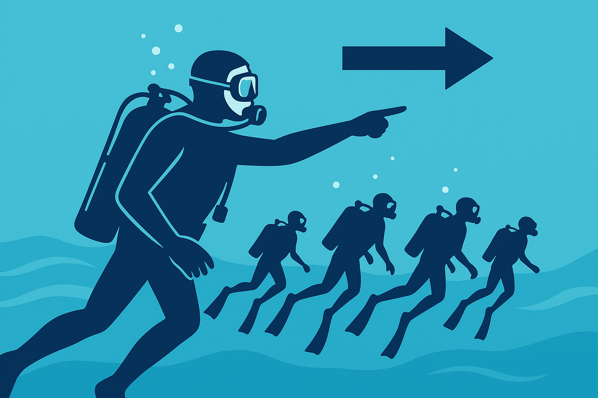

<!--
_paginate: skip
_class: lead white
-->

# Direction de palanquée

#### Plan your dive and Dive your plan

Sébastien Verbois

---

# Attitudes

- **Directif** : agir en chef, exprimer clairement ses consignes et décisions, sans agressivité.
- **Calme** : garder son sang-froid, même en cas d’imprévu.
- **Pédagogue** : expliquer simplement, adapter son discours au niveau des plongeurs.
- **Prudent** : anticiper les risques et privilégier la sécurité avant tout.

---

# Quatre temps

1. **Planification** (avant la plongée / la veille) : définir l’objectif, les rôles et les paramètres de la plongée en fonction des personnes, du lieu et du matériel; préparer la sécurité -> plan de plongée
2. **Briefing** (avant la mise à l'eau) : expliquer le déroulement, rappeler les protocoles et signes, organiser la sécurité et vérifier le matériel
3. **Plongée** (pendant la plongée) : exécuter le plan en respectant les règles de sécurité et la communication
4. **Debriefing** (après la plongée) : analyser le déroulement, partager les observations et identifier les points d’amélioration; donner les consignes de sécurité post-plongée

---

<!--
_class: ul2cols
-->

# Planification

8 sujets à aborder

- **A**dministration
- **B**revet / Expérience
- **C**orps
- **D**écompression
- **E**quipement
- **F**aune / Lieu de plongée
- **G**az
- **S**écurité

Regroupés en 3 groupes : Qui ? (ABC) - Où ? (FS) - Comment ? (DEG)

---

# Planification - Administration

- Fédération
  - CMAS, PADI, SDI/TDI, IANTD, GUE
- **En ordre d'assurance**
  - LIFRAS : assurance liée à la cotisation à un club
  - DAN : assurance indépendante très répendue dans le monde
- **En ordre de visite médicale**
  - LIFRAS : visite annuelle valable jusqu'au 31 janvier de l'année suivante
- WHOIS Lifras : https://www9.iclub.be/whois2.asp?ClubID=202

---

# Planification - Brevet

- **Prérogatives**
  - profondeur maximale
  - paliers de décompressions autorisés
- Fréquence de plongées / **Date de la dernière plongée**
- Expérience sur le type de plongée envisagé (bateau, courant, dans le bleu)
- Expérience sur le lieu de plongée

---

# Qui plonge avec qui ?

|                 | NB     | 1★     | 2★       | 3★       | 4★       | AM/MC/MF/MN |
| --------------- | ------ | ------ | -------- | -------- | -------- | ----------- |
| **NB**          | **NA** | NA     | NA       | NA       | NA       | 15 m        |
| **1★**          | NA     | **NA** | NA       | 20 m     | 20 m     | 20 m        |
| **2★**          | NA     | NA     | **20 m** | 30 m     | 40 m     | 40 m        |
| **3★**          | NA     | 20 m   | 30 m     | **40 m** | 40 m     | 40 m        |
| **4★**          | NA     | 20 m   | 40 m     | 40 m     | **60 m** | 60 m        |
| **AM/MC/MF/MN** | 15 m   | 20 m   | 40 m     | 40 m     | 60 m     | **60 m**    |

- **NA** : Non autorisé
- **Attention** : 2★ + 2★ si 18 ans

---

# Planification - Corps

- Oreille / Sinus / Changement de profondeur
- Consommation habituelle (RMV - https://diving.streamlit.app/rmv)
- Stress (visibilité, faille, grotte)
- Sensibilité à la narcose
- Sensibilité au froid
- Envie de plonger
- Autres ?

---

# Planification - Décompression

- Type d'ordinateur / Backup
- Sévérité / Gradients facteurs
- **Réaliser une simulation** (voir le cour *Décompression*)
- Palier de sécurité
  - 5 min à 5 m si no-déco
  - prolonger le dernier palier de 5 min si déco obligatoire
- Intervalle entre plongées
  - 2 heures si plongée no-déco
  - 3 heures si plongée déco et 4 heures si séjour de plongée intensive

---

# Planification - Equipement

- Combinaison (humide, semi-étanche, étanche)
- Bouteille(s) : capacité, pression, contenu (air, nitrox)
- Détendeurs
- Parachute(s), couteau, masque backup, boussole, lampe(s)
- Matériel adapté (mer/eau douce)
- **Matériel habituel**

---

# Planification - Faune / Lieu de plongée

- Réglementation pays/site : Profondeur max / PpO2 max / Déco OK
- Météo / Température eau / Courant / Thermocline
- Caractéristiques : Plan / Maquette , Attraits, **Dangers**
- **Envies particulières**

---

# Planification - Gas

- Pression de demi-tour (Turn pressure)
- Réserve
  - Profondeur maximale + 10 bars
  - Régle des 1/3 : 1/3 aller, 1/3 retour, 1/3 réserve
- Voir par exemple : https://diving.streamlit.app/planning

---

# Planification - Sécurité

- Prévoir bouteille d'oxygène, bouteille de sécurité pour palier, trousse de premiers soins et défibrillateur
- Prévoir de quoi s'hydrater
- Moyen de communication : GSM, radio VHF
- Adresse caisson hyperbare le plus proche
- Numéros d'urgence : 112, DAN, caisson,...
- Matériel de sécurité spécifique du lieu (infirmerie, défibrillateur,...)
- Organisation de la sécurité / Protocole en cas d'incident
- Rédiger un **Plan de secours**

---

# Plan de plongée

Le plan de plongée est la synthèse de la planification.

- **Objectif** : exploration, formation, photo, etc.
- **Site** : lieu précis, conditions attendues (courant, visibilité, température).
- **Sécurité** : procédures d’urgence, matériel de secours, point de sortie.
- **Logistique** : bateau, horaires, météo, moyens de communication.
- **Profil** : profondeur maximale, durée maximale, pression de demi-tour, paliers, pression de réserve
- **Palanquée** : rôles, serre-file, binômes et responsabilités.

---

# Briefing (PPP-SS-M)

**3, 2, 1 : plonger !**

- **P**aramètres
- **P**rofil
- **P**rotocoles (What if ?)
- **S**écurité
- **S**ignes
- **M**atériel (Gear check)

---

# Briefing - Paramètres

Rappel des paramètres du plan de plongée.

---

# Briefing - Profil

Visualiser la plongée.

- Mise à l'eau : gonfler son gilet, CP premier et SF dernier
- Arrêt à 5m : bubble check, check ordi, check pression
- Descente : pas plus bas que CP
- Fond : signaler "turn pressure" / 100 bars, signaler réserve
- Remontée : vitesse max de 10m/min, pas plus haut que CP
- Surface : rester groupé, palier de surface
- Sortie : SF premier, CP dernier

---

# Briefing - Protocoles

- 5 stops
  - TTS atteint
  - Temps de plongée atteint
  - Réserve atteinte
  - Rappel (bateau)
  - Incident non maîtrisé
- Perte de compagnon, Essoufflement, Givrage

---

# Briefing - Sécurité

- Plan de secours à portée
- Place du défibrillateur
- Bouteille d'oxygène équipée et sur le bord
- Bouteille de réserve équipée
- Annonce départ, annonce retour

---

# Briefing - Signes

- Signes pression, mi-pression, réserve
- Signes problèmes (panne d'air, oreille, froid, essoufflement, crampe,...)
- Signe question
- Signes paliers : une minute avant, TTS
- Signe parachute
- Signes avec lampe, Eviter d'éblouir

---

# Briefing - Matériel

- **check respiration**
  mélange / pression / détendeur principal / détendeur secondaire
- **check équilibrage**
  gilet / inflateur / purges / lestage
- **check matériel**
  ordinateur(s) / lampe(s) / parachutes(s) / masque de secours / couteau
- **signes distinctifs**
  - couleurs / matériel particulier

---

# Plongée

1. Signaler son départ
2. Mise à l'eau : **gonfler son gilet**, surveiller ordre de mise à l'eau
3. Arrêt à 5m : bubble check, **check ordi**, check pression
4. Descente : pas plus bas que CP
5. Fond : **check consommation**, check froid
6. Remontée : pas plus vite que CP
7. Surface : rester groupé
8. Sortie : surveiller sécurité échelle
9. Signaler son retour

---

# Debriefing

- **Paramètre** de la plongée / Compléter le carnet
- **Echange** : commentaires, observations, incidents, points positifs/négatifs
- **Sécurité** : pas d'effort, pas d'apnée, pas d'avion avant 12H si plongée unitaire no déco et 24H sinon, s'hydrater, pas de sauna
