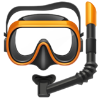
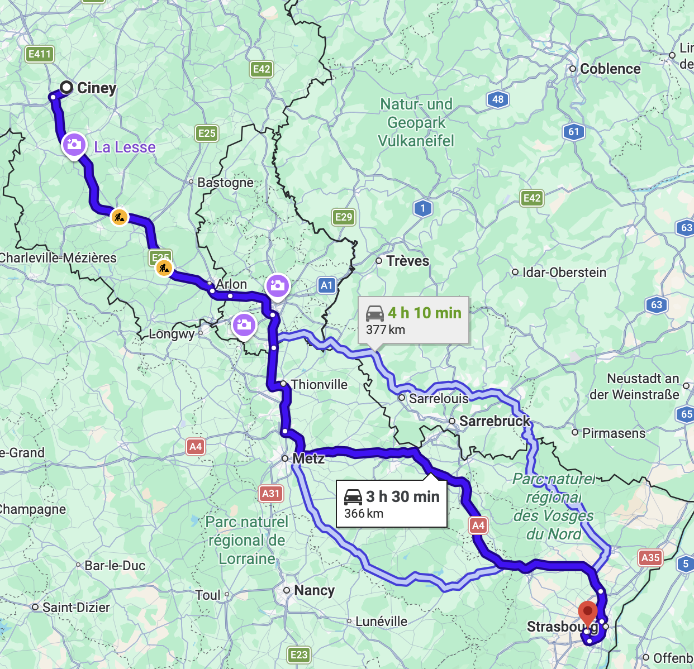
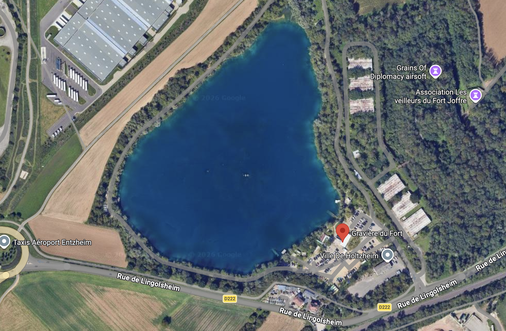
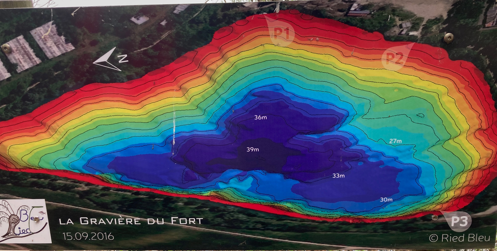
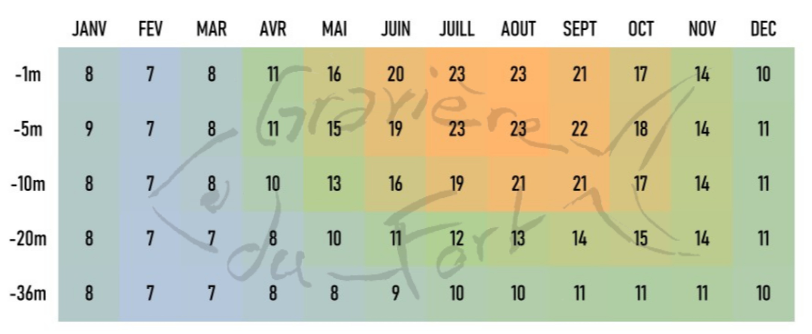

<!--
_paginate: skip
_class: lead
-->

# Séjour Gravière du Fort

#### du 18 juillet au 21 juillet 2026

EPSM Ciney

---

# Infos générale

La Gravière du Fort est une ancienne sablière ouverte aux plongeurs depuis 2010 qui se situe à quelque km de Strasbourg en France.

- **Adresse** : rue de Lingolsheim - 67810 Holtzheim
- **Ouverture** : plongée autorisée 24H/24H tous les jours de l'année
- **Fréquentation** : Plan d'eau qui attire le plus de plongeurs en France

---

# Trajet

- 365 km de Ciney
- 3H30 de route
- Attention à la zone basse émission. Une vignette peut être nécessaire. Voir https://www.strasbourg.eu/la-zfe-m et https://www.certificat-air.gouv.fr/

---

# Vue aérienne

---

# Caractéristiques principales

- 3 pontons pour la mise à l'eau
- 39 m de profondeur maximale
- 400 m de long
- très grande zone à moins de 30m
- thermocline
    - température en temps réel : https://gravieredufort.fr/w/meteo
    - températures moyennes : https://gravieredufort.fr/w/meteo

---

# Plan

---

# Températures moyennes mensuelles

---

# Photos

**Cadre** : Plan d'eau, Table de pique-nique

**Parking** : Entrée, Zone de parking

**Locaux** : Gonflage, Tentes, Locaux de cours (payant), Toilettes

**Plongée** : Pontons, Artefacts sous l'eau, Faune et flore

---

# Sécurité

- un défibrilateur est disponible sur place
- obligation de deux détenteurs indépendants (2 premiers étages)
- bouteille d'oxygène et trousse de secours à emporter
- bouteille d'air de réserve pendue au ponton
- plan de secours : https://gravieredufort.fr/uploads/menus/270/lAecBPzTGs5qfdU443fuZ7Jbe1zSqCLW/media/plandesecours2023v2r.pdf

---

# Gonflage

- gonflage sur place possible (4€)
- maximum 200 bar donc 190 bar à la mise à l'eau
- possibilité de gonfler au Nitrox et à l'Oxygène au magasin Aquadif
    - https://www.aquadif.com/

---

# Séjour 18 juillet au 21 juillet 2026

- 1 plongée le samedi 18 juillet après-midi
- 2 plongées le dimanche 19 juillet
- 2 plongées le lundi 20 juillet
- 1 plongée le mardi 21 juillet matin

---

# Logement

- Airbnb
    - seulement des petits logements disponibles
- Hôtels pas cher : https://gravieredufort.fr/w/adresses
    - attention pour secher le matériel
    - Hôtel B&B - Holtzheim (déjeuner pas top)
    - Hôtel Kyriad - Lingolsheim
- Camping de Strasbourg (à 6 km)

---

# Restauration

## Sur place

- Petite restauration disponible sur place mais pas top (lent et nourriture de base)

## Restaurant l'Authentic

- Site web : https://lauthentic-holtzheim.fr/
- Carte : https://gusty.app/menu/l-authentic

---

# Coût

- ~ 5 € pour la vignette Crit'Air
- 5€ par plongée
- 4€ par gonflage
- ~ 65€ par nuit dans petit hôtel pour chambre de deux
- ~ 30€ pour resto du soir

---

# Contacts

## Organisateur

- Sébastien Verbois : +32 486 316 339

## Moniteur responsable

- Frédéric Laloux (Grand Fred) : +32 474 33 11 73

---

# Echange

- Heures de plongée, plongée en soirée ?
- Restaurant ?